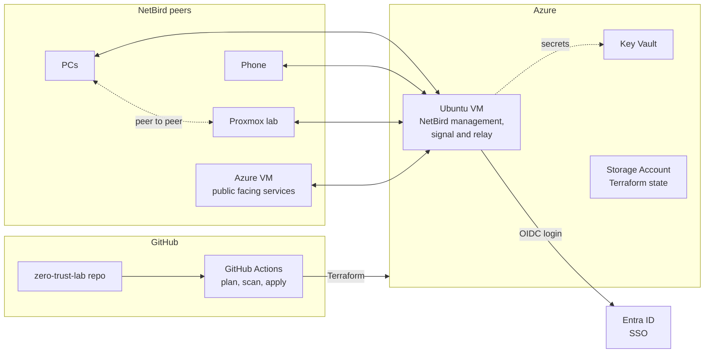

# zero-trust-lab

Rebuilding my homelab from scratch, this time with zero-trust access, everything in code, and security checks in the pipeline. I'm building it in public, so this repo will show the whole journey, including the bits that break.

> **Status:** Early days. Planning and initial Terraform. See the [progress log](#progress-log) below.

## Why

I've used Tailscale for a long time to get into my lab, and it's a great product. But the control plane belongs to someone else. I want to own the whole stack, so the access layer for this lab is a self-hosted [NetBird](https://netbird.io) instance running in Azure.

The other goal is to build it the way I'd want to build it at work: infrastructure as code, no clicking around in portals, secrets kept out of Git, and every change going through a pipeline that scans it before it deploys.

## Architecture



NetBird's server coordinates the network, but traffic between peers goes directly peer to peer where possible, falling back to the relay when it can't.

## Stack

| Area | Tool |
| --- | --- |
| Access layer | NetBird (self-hosted) |
| Identity | Entra ID (OIDC SSO) |
| Cloud | Azure |
| Compute | Ubuntu VM running Docker Compose |
| Infrastructure as code | Terraform |
| CI/CD | GitHub Actions |
| Security scanning | Checkov / tfsec (TBC) |
| Secrets | Azure Key Vault |
| Terraform state | Azure Storage remote backend |
| DNS | Cloudflare |
| Lab | Proxmox |

## Design decisions

**Why a VM and not Container Apps or AKS?**
NetBird needs UDP for its relay traffic, and Container Apps ingress doesn't support UDP. AKS would work, but it's overkill for a handful of containers and would blow the budget. A small VM is cheap, simple and fully reproducible with Terraform.

**Why Entra ID?**
Access should be tied to a real identity with MFA, not just a key sitting on a device. It also means I can use conditional access later.

**Why remote state?**
This repo is public. Terraform state can contain sensitive values, so it never touches Git. It lives in an Azure Storage account instead.

More decisions will be written up in [`docs/decisions`](docs/decisions) as I make them.

## Repo layout

```
zero-trust-lab/
├── netbird-azure/      # Terraform for the NetBird server in Azure
├── proxmox/            # Terraform + Ansible for the lab (later)
├── docs/               # Diagrams and decision records
└── .github/workflows/  # One workflow per folder, path filtered
```

Each folder has its own Terraform state, and each workflow only runs when its own folder changes.

## Roadmap

**Phase 1: NetBird on Azure**
- [ ] Remote state backend
- [ ] Networking (VNet, subnet, NSG)
- [ ] Ubuntu VM with cloud-init
- [ ] NetBird running in Docker Compose
- [ ] Entra ID SSO
- [ ] DNS through Cloudflare
- [ ] First peers connected

**Phase 2: Pipeline**
- [ ] GitHub Actions running `terraform plan` on pull requests
- [ ] Security scanning on Terraform
- [ ] OIDC auth from GitHub to Azure (no stored credentials)
- [ ] Apply on merge to `main`

**Phase 3: Proxmox rebuild**
- [ ] Proxmox host joined to NetBird
- [ ] VMs defined in Terraform
- [ ] Config with Ansible
- [ ] Self-hosted runner in the lab

## Cost

Target: under £30 a month for the Azure side. I'll post the real numbers once it's been running for a while.

## Progress log

| Date | Update |
| --- | --- |
| Oct 2026 | Repo created, plan written up |

## Follow along

I'm posting progress on [LinkedIn](https://www.linkedin.com/in/YOUR-PROFILE). If you've self-hosted NetBird or done something similar and have advice, open an issue or get in touch.

## Licence

MIT
